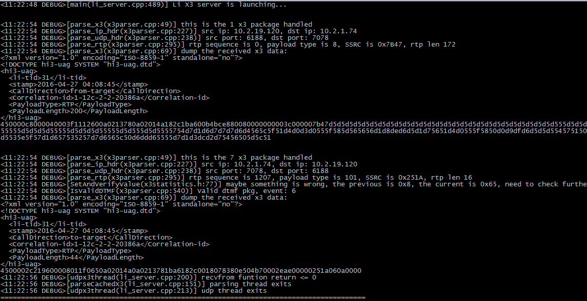
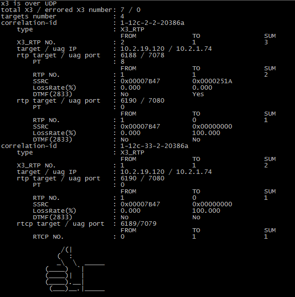

**Simulated Lawful Interception X3 Server for LI testing**
---
This server can be used to decode and analysis received X3 message on both TCP and UDP. RTP X3 pipeline - IPv4/IPv6/UDP/RTP/RTCP/DTMF info and MSRP X3 pipeline IPv4/IPv6/TCP/MSRP info can be obtained from x3 package and a lot of check points are executed for verification.  
- For X3 over TCP: tcp segments are handle so no need to worry about incomplete or multiple X3 packages received in a single tcp segment.
- For X3 over UDP: a separate cache thread is implemented to avoid package drop due to handling of heavy udp traffic. 
- This server supports multiple targets monitoring.  

**No commercial usage permitted!**  
```
[root@promote Lawful_Interception_x3_server]# ./li_server 


usage:

./li_server -l local_ip:local_port [optional options]

    -l : mandatory arguments, specify the local ip and port for listening x3, separated by ':'
    -T : timeout timer for socket recv if no pkg is received at all, in seconds, the default is 60s
    -t : timeout timer for socket recv if x3 pkg has been received, in seconds, the default is 2s
    -w : specify the outputed log file path and file name, the default is /tmp/li.log
    -f : specify the original pcap file to be compared with received x3
    -c : enable the IPv4 hdr checksum
    -d : dump the x3 msg body

Example:

    ./li_server -l 10.2.22.150:20000 -d

    or

    ./li_server -l 10.2.22.150:20000 -d -c -T 10 -w /root/my-li.log -f /root/srtp/rtp-rtcp.pcap
```
```
Result Sample:
./li_server -l 127.0.0.1:20000 -d
```


